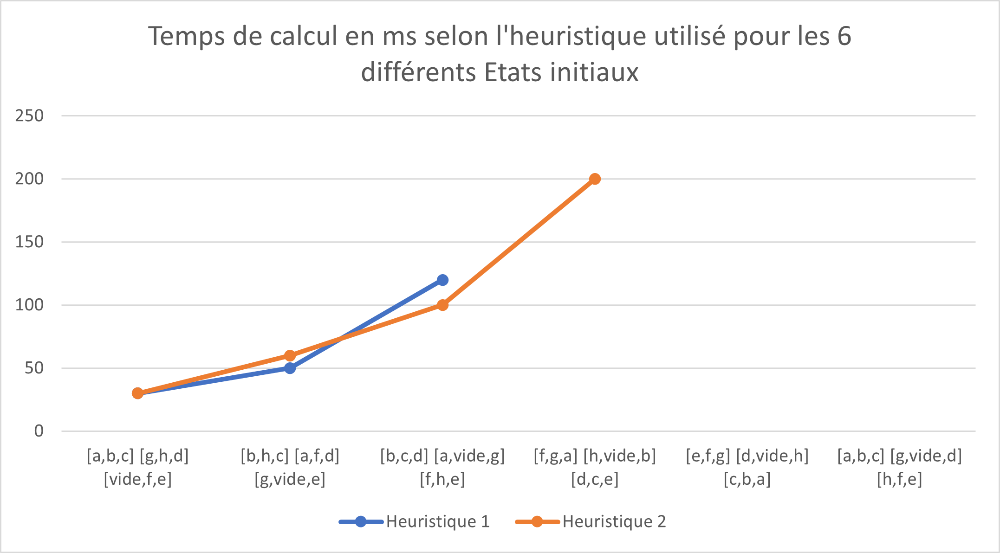

# Compte Rendu des TPs d'IA

Yohan JARNAC - Pascal ANDRAWS  
4IR I B1

## TP n°1 : Algorithme A* appliqué au Taquin

### 1. Familiarisation avec le problème du Taquin 3x3

#### 1.2.a) Quelle clause Prolog permettrait de représenter la situation finale du Taquin 4x4 ?
```
final_state([1,  2,  3,  4],
            [5,  6,  7,  8],
            [9,  10, 11, 12],
            [13, 14, 15, vide]).
```

#### 1.2.b) A quelles questions permettent de répondre les requêtes suivantes ?
```
?- initial_state(Ini), nth1(L,Ini,Ligne), nth1(C,Ligne,d).
```
Cette requête renvoie les coordonnées __(L,C)__ de __d__ dans la matrice __Ini__.  

```
?- final_state(Fin), nth1(3,Fin,Ligne), nth1(2,Ligne,P).
```
Cette requête renvoie __P__ qui est l'élément présent aux coordonnées __(3,2)__ dans la matrice __Fin__.  

#### 1.2.c) Quelle requête Prolog permettrait de savoir si une pièce donnée P est bien placée dans U0 (par rapport à F) ?
###### Pour P = a qui n'est pas bien placée
```
initial_state(U0),
final_state(F),
nth1(L,U0,Ligne),
nth1(C,Ligne,a),
nth1(L,F,LigneF),
nth1(C,LigneF,a).
```
Swi-Prolog renvoie alors :
```
false
```
###### Pour P = c qui est bien placée
```
initial_state(U0),
final_state(F),
nth1(L,U0,Ligne),
nth1(C,Ligne,c),
nth1(L,F,LigneF),
nth1(C,LigneF,c).
```
Swi-Prolog renvoie alors :
```
U0 = [[b, h, c], [a, f, d], [g, vide, e]],
F = [[a, b, c], [h, vide, d], [g, f, e]],
L0 = 1,
Ligne = [b, h, c],
C0 = 3,
LigneF = [a, b, c]
```
On obtient en plus les coordonnées de C *qui sont (1,3)*.

#### 1.2.d) Quelle requête permet de trouver une situation suivante de l'état initial du Taquin 3x3 ? *(3 sont possibles)*
```
?- initial_state(Ini), rule(R,1,Ini,Suivant).
```

#### 1.2.e) Quelle requête permet d'avoir ces 3 réponses regroupées dans une liste ? 
```
?- initial_state(Ini), findall(Suivant, rule(R,1,Ini,Suivant), L).
```

#### 1.2.f) Quelle requête permet d'avoir la liste de tous les couples [A,S] tels que S est la situation qui résulte de l'action A en U0 ?
```
?- initial_state(Ini), findall([A,S], rule(A,1,Ini,S), L).
```
### 3.3 Analyse expérimentale

#### Temps de calcul de A*


Nous pouvons constater que sur des cas simples avec seulement quelques déplacements nécessaires à la résolution, l'heuristique 1 procure un plus faible temps de calcul.  
Cependant, l'heuristique 2 va rapidement être préférée de par son temps de calcul plus faible pour des situations initiales plus complexes, mais aussi car elle va réussir à trouver une solution à ces dernières. Notre code n'étant pas optimal, nous n'avons pas de solution pour l'avant-dernier cas mais nous en avons une pour le précédent, solution que l'heuristique 1 ne nous procure pas.

#### Quelle longueur de séquence peut-on envisager de résoudre pour le Taquin 4x4 ?

On peut envisager de résoudre des séquences de longueur similaire à celles que nous venons de faire. Cela demandera un plus long temps de calcul et un plus grand espace de stockage mais un plus grand nombre de cases n'implique pas une augmentation de la difficulté puisque la méthode reste la même.

#### A* trouve-t-il la solution pour la situation initiale suivante ?
```
initial_state([[a,b,c],[g,vide,d],[h,f,e]]).
```
Cet état initial n'étant pas connexe avec l'état final, il n'existe donc aucune séquence permettant de passer de cet état initial à l'état final, donc A* ne trouve bel et bien aucune solution.

#### Quelle représentation de l’état du Rubik’s Cube et quel type d’action proposeriez-vous si vous vouliez appliquer A*?

Un état du Rubik's Cube serait une liste de matrice, chaque matrice étant une face du Rubik's Cube et nous aurions les différents couleurs *(blanc, jaune, vert, bleu, orange, rouge)* à la place des lettres.  
De plus, il serait nécessaire de définir les différents actions possibles *(face que l'on fait tourner et dans quel sens)* afin d'obtenir les états suivants.  
Une fois ceci effectué, on pourrait appliquer A* afin de savoir comment résoudre notre Rubik's Cube selon la situation de départ.

## TP n°2 : Algorithme Negamax appliqué au TicTacToe

### 1. Familiarisation avec le problème du TicTacToe 3x3

#### 1.2 Quelle inteprétation donnez-vous aux requêtes suivantes ?
```
?- situation_initiale(S), joueur_initial(J).
```
Cette requête définit l'état initial du jeu *(une grille de 3x3 vide)* ainsi que le joueur initial *(qui est définit arbitrairement comme étant le joueur __x__)*

```
?- situation_initiale(S), nth1(3,S,Lig), nth1(2,Lig,o)
```
Cette requête indique qu'un __o__ est placé aux coordonnées __(3,2)__

#### 2.2 Proposez des requêtes de tests unitaires pour chaque prédicat.
##### Tests et réponses de Swi-Prolog pour `alignement-gagnant(Ali,J)`
```
?- alignement_gagnant([x,x,x],x).
true.
?- alignement_gagnant([o,o,o],x).
false.
?- alignement_gagnant([_,o,_],x).
false.
?- alignement_gagnant([o,o,o],o).
true.
?- alignement_gagnant([x,x,x],o).
false.
?- alignement_gagnant([_,x,o],o).
false.
```
##### Tests et réponses de Swi-Prolog pour `alignement-perdant(Ali,J)`
```
?- alignement_perdant([x,x,x],x).
false.
?- alignement_perdant([o,o,o],x).
true.
?- alignement_perdant([_,o,_],x).
false.
?- alignement_perdant([o,o,o],o).
false.
?- alignement_perdant([x,x,x],o).
true.
?- alignement_perdant([_,x,o],o).
false.
```
### 2. Développement de l'heuristique *h*

#### Proposer une requête permettant de tester votre heuristique dans la situation initiale (elle doit retourner 0 quel que soit le joueur).
```
?- heuristique(x,[[_,_,_],[_,_,_],[_,_,_]],H).
H = 0.
?- heuristique(o,[[_,_,_],[_,_,_],[_,_,_]],H).
H = 0.
```

#### Proposer d’autres tests unitaires pour vérifier qu’elle retourne bien les valeurs attendues dans le cas d’une situation gagnante pour J, perdante pour J ou nulle.
##### Situation gagnante pour __x__
```
?- heuristique(x,[[x,x,x],[o,o,_],[_,_,_]],H).
H = 10000.
?- heuristique(x,[[x,o,_],[x,o,_],[x,_,_]],H).
H = 10000.
?- heuristique(x,[[x,o,_],[o,x,_],[_,_,x]],H).
H = 10000.
```
##### Situation perdante pour __o__
```
?- heuristique(o,[[x,x,x],[o,o,_],[_,_,_]],H).
H = -10000.
?- heuristique(o,[[x,o,_],[x,o,_],[x,_,_]],H).
H = -10000.
?- heuristique(o,[[x,o,_],[o,x,_],[_,_,x]],H).
H = -10000.
```
##### Situation nulle
```
?- heuristique(x,[[x,o,x],[o,o,x],[x,x,o]],H).
H = 0.
```

### 3. Développement de l'algorithme Negamax

#### Quel prédicat permet de connaître sous forme de liste l’ensemble des couples `[Coord, Situation_Resultante]` tels que chaque élément *(couple)* associe le coup d’un joueur et la situation qui en résulte à partir d’une situation donnée.
Soit `J` le joueur, `Etat` la situation actuelle, alors `Succ` est la liste des situations possibles selon où joue `J`.
```
?- successeurs(J,Etat,Succ).
```

### 4. Expérimentations et extensions

#### 4.1 Indiquez le meilleur coup à jouer et le gain espéré pour une profondeur d’analyse de 1, 2, 3, 4 , 5 , 6 , 7, 8, 9.

